## License

Licensed under the MIT License.  
See the [LICENSE](LICENSE) file for more information.

  

<!-- project overview -->

> JaMate is a platform that smartly matches musicians to jam together, form bands, and collaborate(inspired by tinder). In addition ,it understands short recording snippets (mood, key, tempo, energy , etc..) to analyze track-to-track compatibility and generate adaptive backing tracks for seamless jamming.

  

<!-- System Design -->

### Entity Relationship Diagram

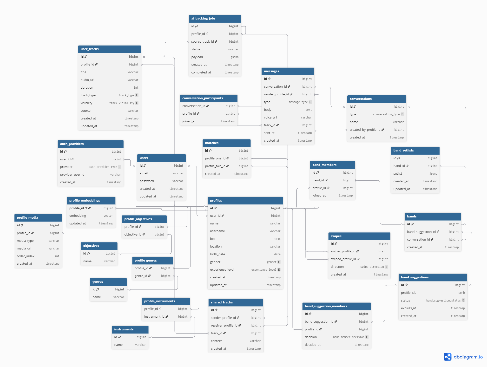

### System design

### n8n

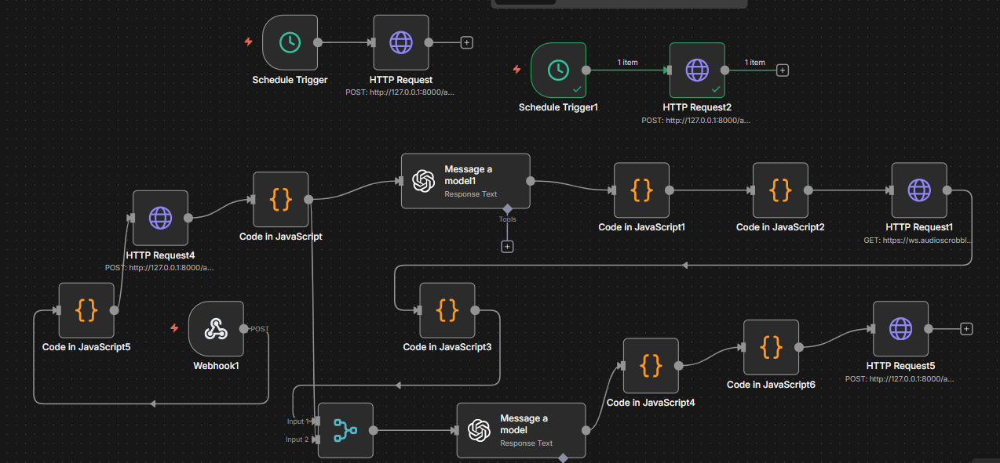

  

<!-- Project Highlights -->

### Interesting feature

- Musician matching: Builds a personalized discovery feed by embedding user profiles, musical preferences, and activity, to surface the most relevant matches.

- Adaptive backing track generation: Uses pre-trained machine learning models to analyze short recording snippets (mood, key, tempo, etc.), analyze the compatibility of two tracks for jamming, and generate backing tracks that adapt to the musician’s sound.

- Band suggestions: Uses scheduled workflows, AI and similarity scoring to periodically evaluate embeddings and recommend potential band formations over time.

- AI-assisted setlist generation: An n8n workflow that analyzes band context and uses Spotify song metadata to build and order live-performance setlists.

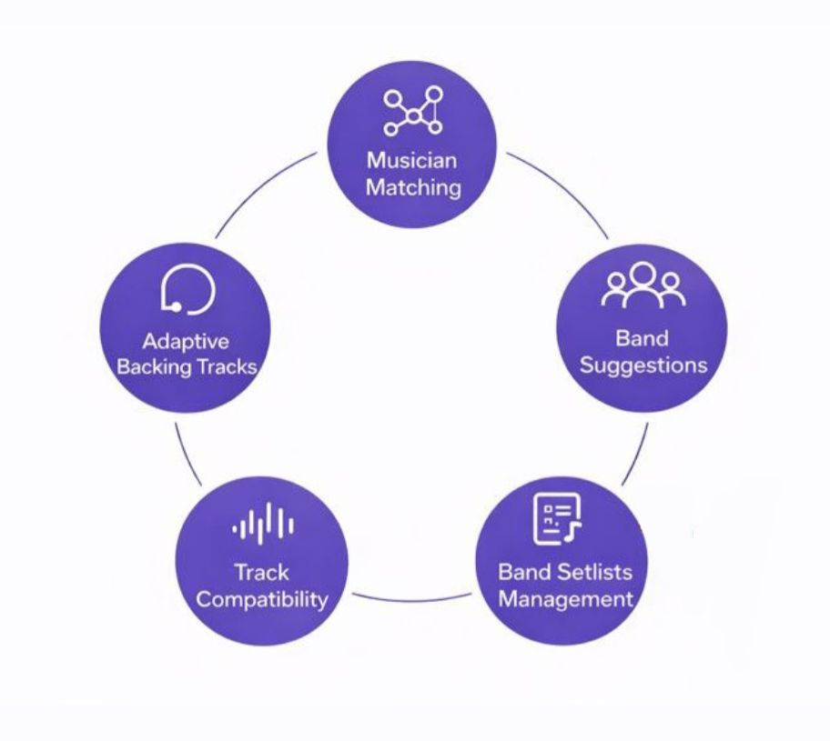

  

<!-- Demo -->

### User Screens (Mobile)

| Landing | Register | Login |
|--------|----------|-------|
|  |  |  |

| Create profile | Goals | Bio |
|---------------|-------|-----|
|  | 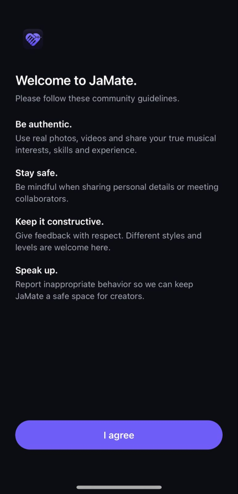 |  |

| Feed | Match | Band suggestions |
|------|-------|------------------|
|  |  |  |

| Tracks | Record | AI Backing tracks |
|--------|--------|-------------------|
|  |  |  |

| Direct chats | Jam compatibility | Band chats |
|--------------|-------------------|------------|
|  | 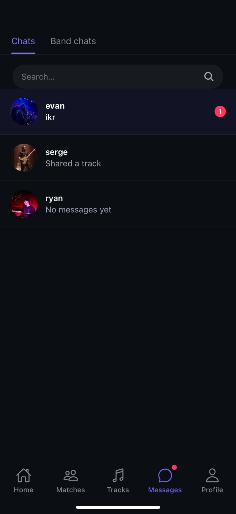 |  |

| Group convo | Setlist | Members |
|-------------|---------|---------|
| 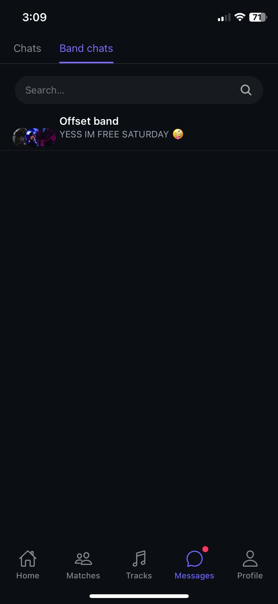 |  | 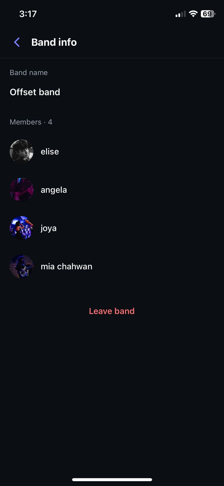 |

| Profile | Profile media | Edit profile |
|---------|---------------|--------------|
|  | 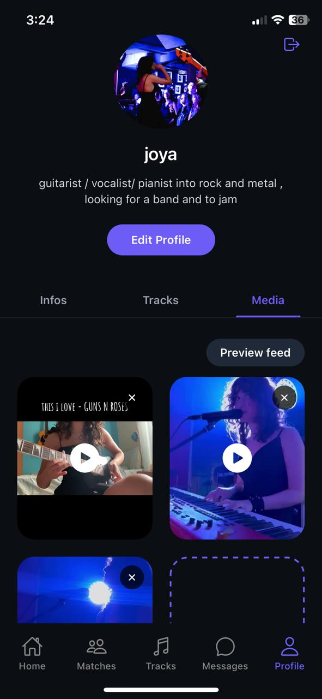 | 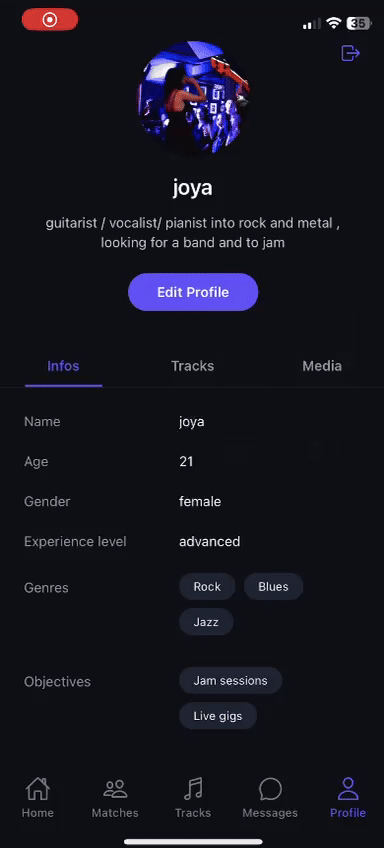 |

### Design

**Figma design**  
View the full UI and interaction flows on Figma:  
 [Open the design file](https://www.figma.com/design/H7B9SAWOytn5TBotlrf1b1/JaMate-figma?node-id=0-1&t=lbNFucGi3OifQOTE-1)

  

<!-- Development & Testing -->

| Services                         | Validation                        | Testing                     |
| -------------------------------- | --------------------------------- | --------------------------- |
|  | 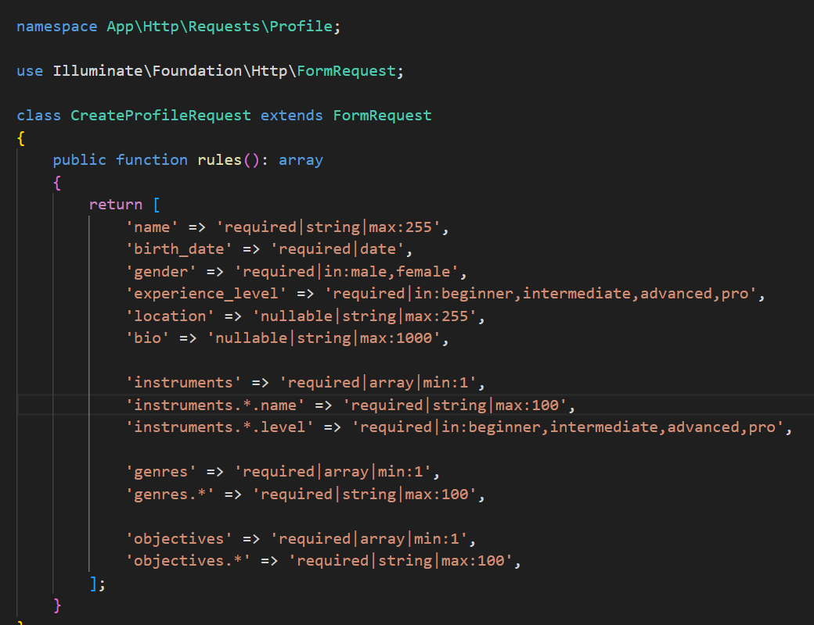 |  |

  

### Performance

- ### Query optimization 

| Old version           | Better version        |
| --------------------- | --------------------- |
|  |  |

- Refactored a complex Eloquent query into a raw SQL query to minimize joins, reduce execution cost, and speed up candidate selection.

- ### Indexing strategy
| Profile media  | Band suggestions    |
| --------------------- | --------------------- |
|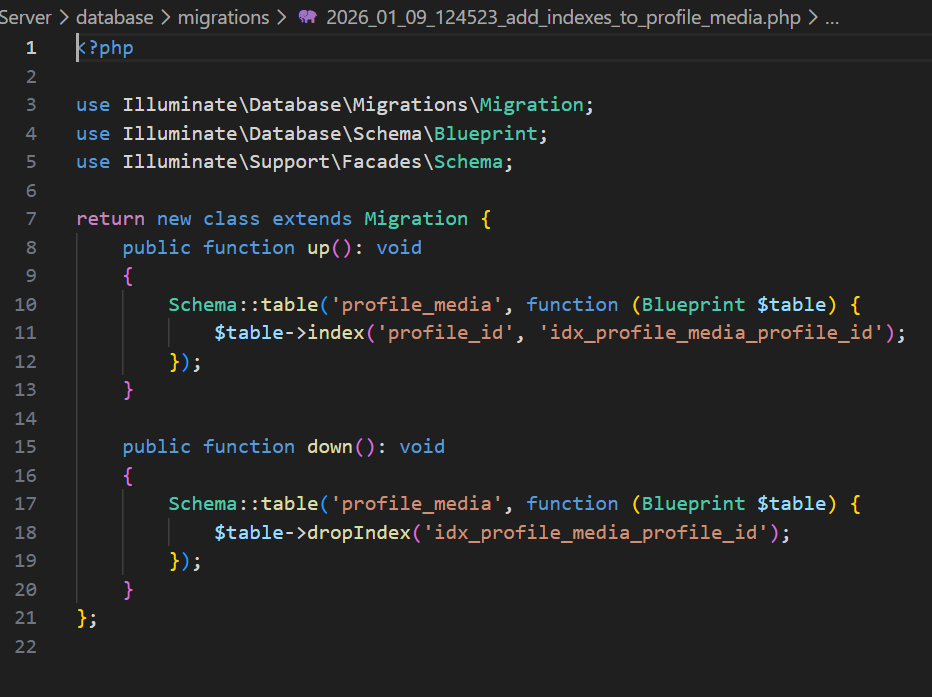 | 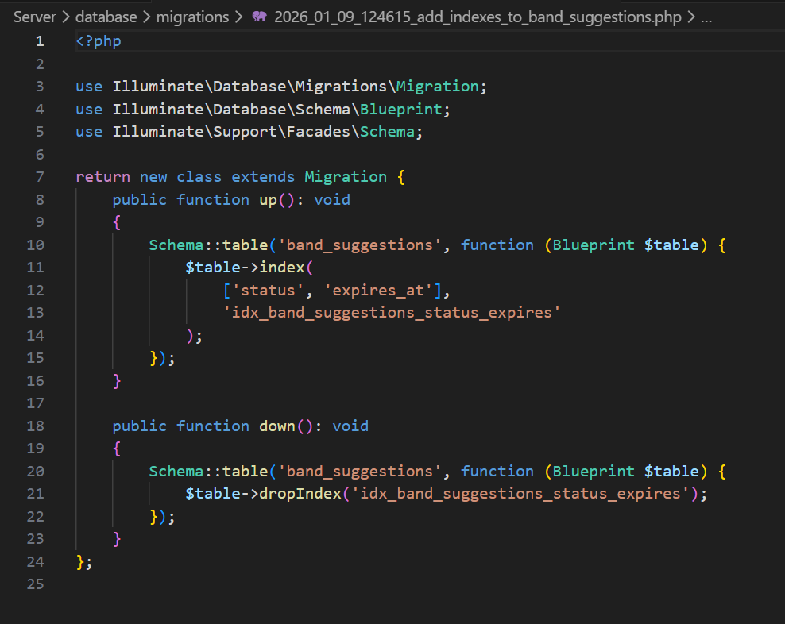 |

- Indexes were added on read-heavy tables to optimize frequent queries and improve overall performance.

  

| Embedding-Driven Music Discovery & Band Formation | Audio analyze and Ai backing tracks |
| ------------------------------------------------- | ----------------------------------- |
|                        |         |

  

### CLAP-Based Audio Semantic Analysis

| Code snippet                | CLAP model overview     |
| --------------------------- | ----------------------- |
|  | 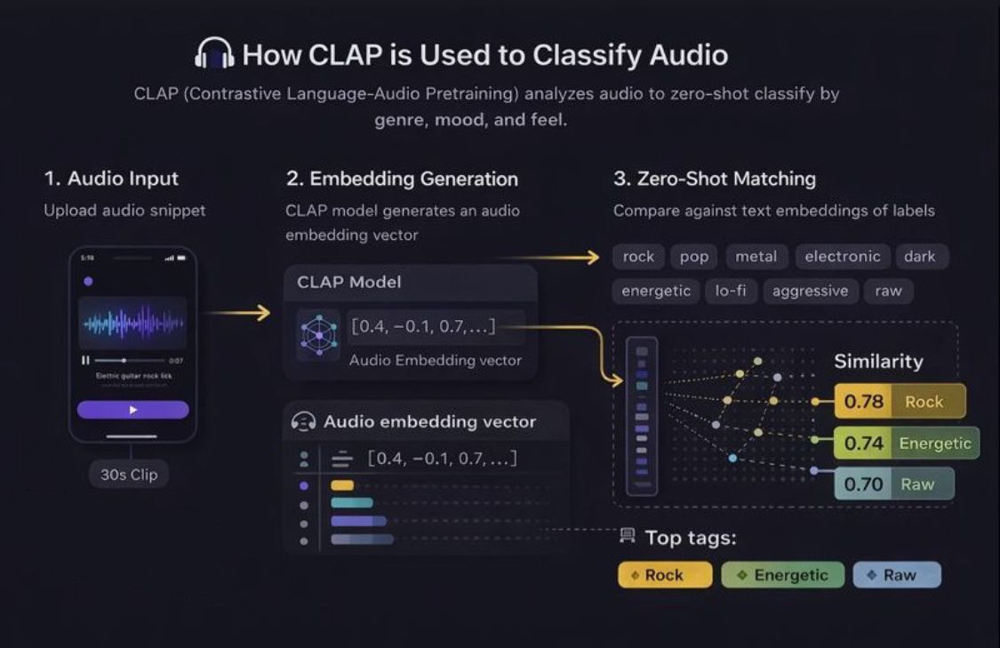 |

### Audio feature extraction pipeline

| Tool / Method                     | Purpose                          |
| --------------------------------- | -------------------------------- |
| SoundFile, librosa                | Audio loading & normalization    |
| Rhythmic onsets                   | Tempo detection                  |
| Chroma analysis + Krumhansl       | Key detection                    |
| Librosa perceptual features       | Energy, dynamics                 |
| CLAP                              | Semantic analysis (style, mood)  |

## AI Agent

During the development of JaMate, I also built a dedicated AI agent designed to answer questions about my SE Factory journey and the projects I worked on, including JaMate.

The agent was built as a standalone project. You can explore its source code here:
👉 https://github.com/joyagergess/sefactory-ai-knowledge-portfolio.git

You can also interact with the AI agent directly to ask about my journey and projects:
👉 http://13.37.217.214/

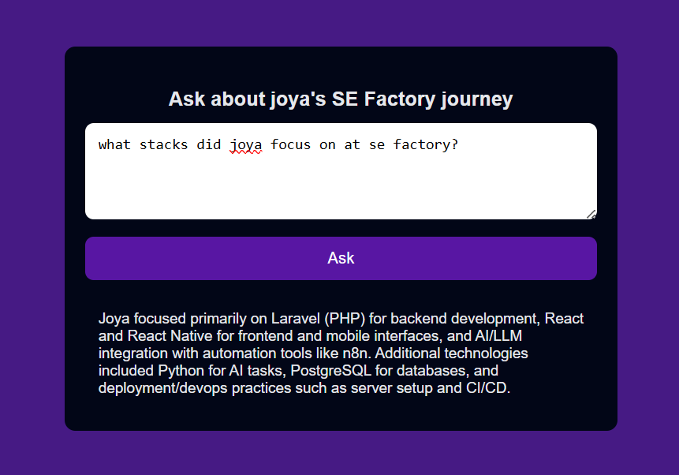

<!-- Deployment -->

- This project uses an automated CI/CD pipeline with GitHub Actions to test and deploy the backend to production.

  
Docker was initially planned for the deployment setup, but hardware limitations preventing local virtualization led to a direct server-based deployment.

| API Register (Swagger) | CI / CD |
| --------------------- | ------- |
| 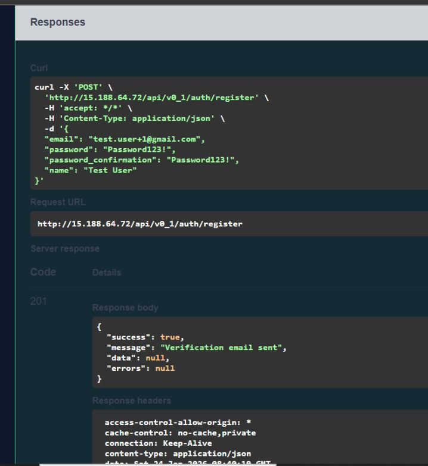 | 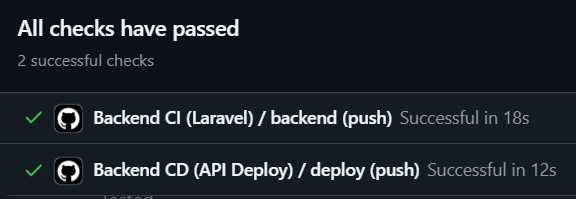 |

  
